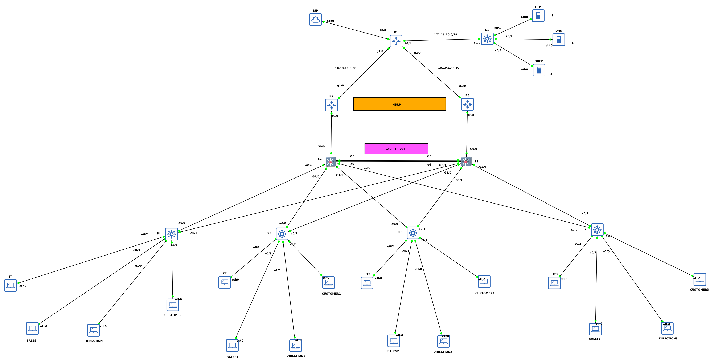

# 🔧 Network Automation Project with Python & Netmiko



This is a personal project simulating a real-world enterprise network using **GNS3**, with **Cisco routers and switches**, and automating configurations using **Python and Netmiko&Paramiko**.

## 🏗️ Network Design

- **3-tier architecture (Cisco Model)**:
  - **Core Layer**: R2, R3 with HSRP
  - **Distribution Layer**: S2, S3 with EtherChannel (LACP) and PVST
  - **Access Layer**: S4–S7, with VLAN segmentation and security (DHCP Snooping, DAI, Port Security)

- **Services deployed**:
  - **FTP, DNS, DHCP servers**
  - **Redundancy with HSRP**
  - **Monitoring with Prometheus + Grafana (snmp_exporter)**

## 🛠️ Automation Features

- Automatic configuration of:
  - VLANs
  - EtherChannel (LACP)
  - Port-Security and Sticky MAC
  - DAI & DHCP Snooping
- Secure access via `.env` file
- Backup

## 📁 Project Structure

- `script.py`: main automation script for R1 to S7
- `server.py`: main automation script for servers
- `topology/lab.png`: image and description of the lab
- `config_equipement/`: backup for each equipment
- `config_server/`: backup for DHCP,DNS

## 🚀 Getting Started

```bash
git clone https://github.com/fan40/python_network_automation.git
cd python_network_automation
python3 -m venv venv
source venv/bin/activate
pip install -r requirements.txt
cp .env.example .env  # then edit with your credentials
python script.py
